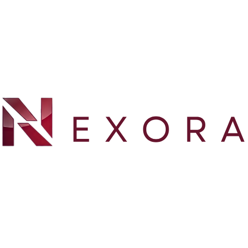

# 👋 Hi, I'm Mohammed Aadil

🚀 Founder & Lead Developer at Nexora  
💻 Web Developer | IoT & Embedded Systems Enthusiast  

I build modern, high-performing websites and develop real-world tech solutions focused on clean UI/UX, performance, and real impact.

---

## 🌐 Portfolio & Brand

<a href="https://mohammedaadil-portfolio.vercel.app/" target="_blank">
 Portfolio
</a>
&nbsp;&nbsp;
<a href="https://nexora-devstudio.vercel.app/" target="_blank">
 Nexora
</a>

---

## 💫 About Me
I specialize in creating user-friendly digital experiences and smart systems that solve real-world problems.  
Currently exploring full-stack development, embedded systems, and AI-based applications.

---

## 🌐 Connect with Me

---

## 🛠️ Languages and Tools

### 💻 Development

### ⚙️ Programming

### 🧠 Tools & Platforms

### 🤖 AI / ML & Computer Vision

---

## 📊 GitHub Stats

---
